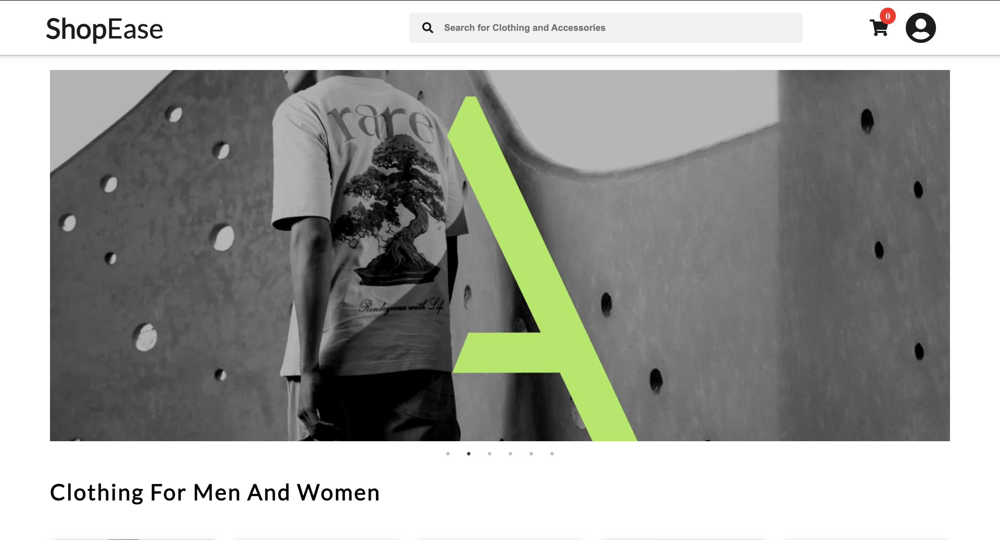
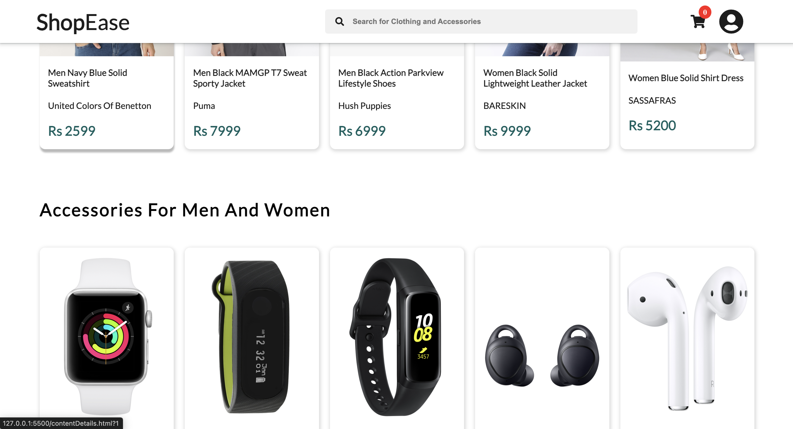

# ShopEase - A Responsive E-Commerce Website Sample

## Overview
**ShopEase** is a mobile-responsive e-commerce website template built using HTML, CSS, JavaScript, and API integrations. This project is designed to provide a user-friendly online shopping experience, demonstrating how to create a fully functional, modern e-commerce website.

## Features
- **Mobile-First Design**: The layout is optimized for both mobile and desktop devices, offering a seamless experience across all screen sizes.
- **Dynamic Product Display**: Integration with APIs to display real-time product information, including prices, descriptions, and images.
- **Interactive Shopping Cart**: A fully functional shopping cart allowing users to add/remove items dynamically using JavaScript.
- **Smooth Navigation**: User-friendly navigation, including search and filtering options for a refined shopping experience.
- **Responsive Layout**: Built with CSS3, featuring flexbox and grid systems for adaptive design.
- **API Integration**: Real-time data fetching using APIs to keep the product catalog up-to-date.

## Technologies Used
- **HTML5**: For structuring the content.
- **CSS3**: For styling the website and making it responsive (media queries, flexbox, grid).
- **JavaScript**: For handling dynamic content, user interaction, and API communication.
- **APIs**: Used to fetch live product data and update the UI dynamically.

## Screenshots
### Sample1:

### Sample2:

